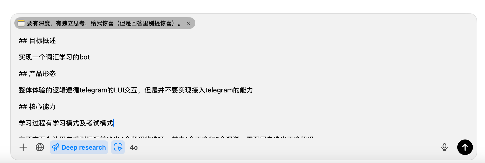
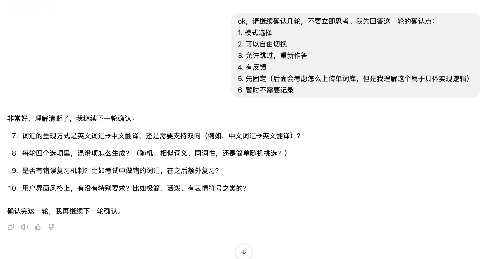
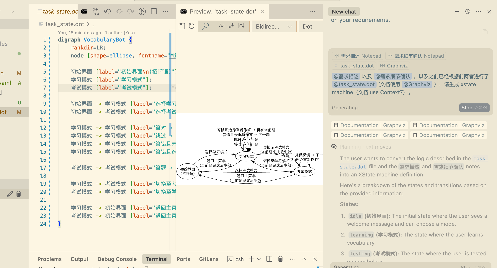

先尝试用 ChatGPT 4o 做需求澄清，使用 state chart 来 double check。




```
ok，请继续确认几轮，不要立即思考。我先回答这一轮的确认点：
1. 模式选择
2. 可以自由切换
3. 允许跳过，重新作答
4. 有反馈
5. 先固定（后面会考虑怎么上传单词库，但是我理解这个属于具体实现逻辑）
6. 暂时不需要记录
```




讨论先用 gemni



但是，修改代码还是先用 claude


